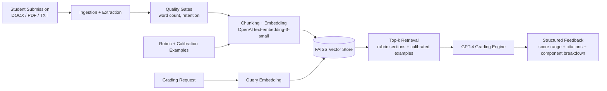
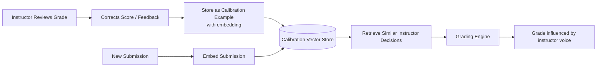

# Project Blackboard

**An AI-assisted grading and feedback system for educational assignments.**

Built with Python, FastAPI, OpenAI, and FAISS. Processes student submissions, retrieves contextually relevant rubric guidance using vector search, and generates structured feedback with citations.

---

## What It Does

Instructors upload assignments and rubrics. Students submit work. Project Blackboard:

1. **Ingests** course materials (syllabus, rubrics, style guides, calibration examples) into a vector store
2. **Retrieves** the most relevant rubric sections and calibrated examples for each submission
3. **Grades** the submission with score ranges tied to rubric criteria
4. **Generates** detailed, citation-backed feedback at each rubric component level
5. **Learns** from instructor corrections through a calibration loop

The result: consistent, auditable, explainable AI-assisted grading that improves over time.

---

## Architecture



### Calibration Loop



---

## Tech Stack

| Layer | Technology |
|---|---|
| API | FastAPI + Pydantic |
| LLM | OpenAI GPT-4 |
| Embeddings | OpenAI text-embedding-3-small |
| Vector Search | FAISS |
| Database | SQLite (calibration store) |
| Document Parsing | pypdf, python-docx |
| Config | python-dotenv |

---

## Key Features

- **Rubric-as-code**: Grading criteria defined in structured config, not buried in prompts
- **Calibration loop**: Instructor corrections feed back into future grading decisions
- **Component-level scoring**: Each rubric criterion graded and cited independently
- **Score ranges**: Outputs score ranges (not single points) to reflect appropriate uncertainty
- **Quality gates**: Validates submission quality before expensive LLM calls
- **Batch grading**: Process entire assignment cohorts via scripts
- **Rate limiting**: Built-in per-IP rate limiting on all API endpoints
- **Audit trail**: Every grading decision logged with inputs, outputs, and retrieval context

---

## Quick Start

```bash
git clone https://github.com/shawmillerman/project-blackboard.git
cd project-blackboard
python -m venv .venv
source .venv/bin/activate
pip install -r requirements.txt

cp .env.example .env
# Add your OPENAI_API_KEY to .env

# Ingest course materials
python -m app.ingest

# Start the API server
uvicorn app.server:app --reload
```

---

## Project Structure

```
project_blackboard/
├── app/
│   ├── server.py          # FastAPI routes + rate limiting
│   ├── grading.py         # Score range computation + component scoring
│   ├── qa.py              # RAG-based rubric answer + feedback generation
│   ├── calibration_api.py # Calibration review endpoints
│   ├── retrieval.py       # FAISS vector similarity search
│   ├── embed.py           # OpenAI embedding wrapper
│   ├── ingest.py          # Document ingestion pipeline
│   ├── chunking.py        # Token-aware text chunking
│   ├── db.py              # SQLite calibration store
│   └── config.py          # App configuration
├── scripts/
│   ├── grade_batch.py     # Batch grade an entire cohort
│   ├── calibration_review.py  # Instructor calibration review workflow
│   └── pre_screen_review.py   # Pre-screen submissions before grading
├── data/                  # Course materials (gitignored)
├── artifacts/             # Vector stores + grading outputs (gitignored)
├── docs/                  # Architecture and roadmap docs
└── requirements.txt
```

---

## What I'd Do Next

- **30 days**: Add a lightweight web UI for instructor review and calibration feedback
- **60 days**: Add multi-course support and per-instructor calibration profiles
- **90 days**: Publish benchmark results comparing calibrated vs uncalibrated grading consistency

---

## License

MIT — see [LICENSE](LICENSE).
